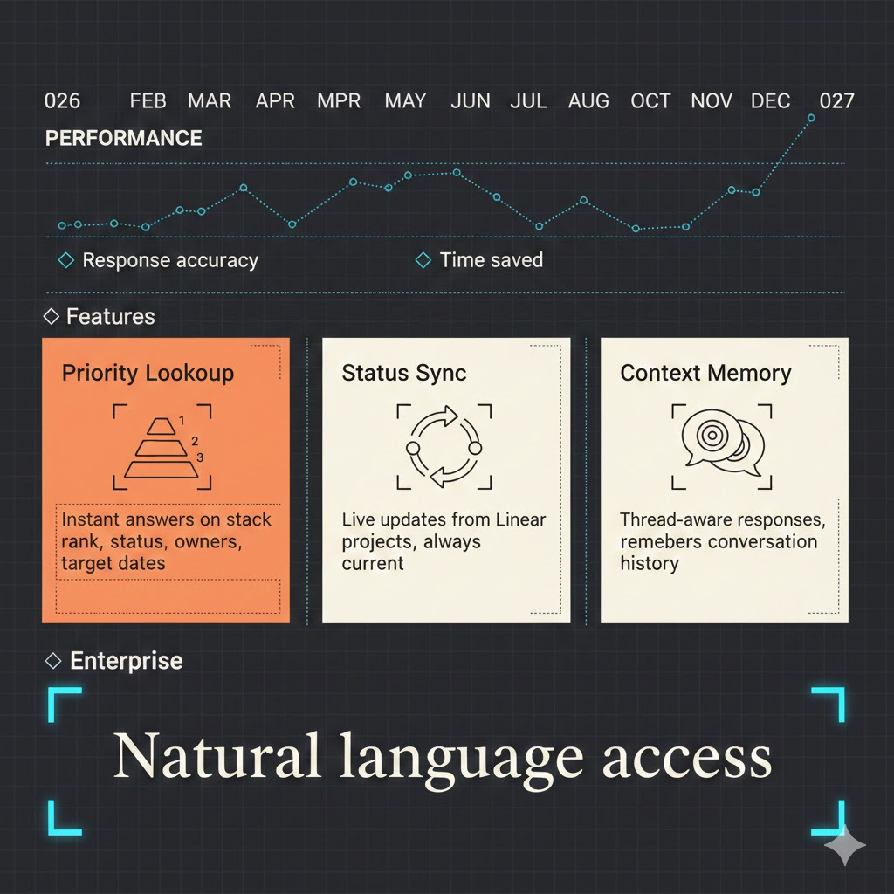

# Chorus

[](https://github.com/gsiener/chorus/actions/workflows/ci.yml)
[](https://slsa.dev)
[](https://justin.searls.co/shovelware/)



An AI-powered Slack bot that answers questions about product roadmap, strategy, and internal knowledge. Powered by Claude.

## Talking to Chorus

Mention **@Chorus** in any channel where it's been invited:

```
@Chorus what's on our product roadmap?
```

```
@Chorus summarize our Q1 priorities
```

```
@Chorus who owns the authentication feature?
```

### Threaded Conversations

Chorus maintains context within threads. Start a conversation and ask follow-up questions naturally:

```
@Chorus what's the status of feature X?
  └── Can you tell me more about the timeline?
      └── Who's working on it?
          └── What are the blockers?
```

You only need to @mention Chorus once at the start of a thread—it will continue responding to follow-ups in that thread.

## What Chorus Knows

Chorus has access to a knowledge base of internal documents including:

- Product roadmaps and strategy docs
- Feature specifications
- Team and ownership information
- Meeting notes and decisions

Ask Chorus anything about these topics and it will find relevant context to answer your question.

## Managing the Knowledge Base

Admins can add, list, and remove documents via the REST API:

```bash
# Set your credentials
export CHORUS_API_KEY="your-docs-api-key"
export CHORUS_URL="https://chorus.your-subdomain.workers.dev"

# Add a document
curl -X POST "$CHORUS_URL/api/docs" \
  -H "Authorization: Bearer $CHORUS_API_KEY" \
  -H "Content-Type: application/json" \
  -d '{"title": "Q1 Strategy", "content": "Our Q1 priorities are..."}'

# List all documents
curl "$CHORUS_URL/api/docs" \
  -H "Authorization: Bearer $CHORUS_API_KEY"

# Remove a document
curl -X DELETE "$CHORUS_URL/api/docs" \
  -H "Authorization: Bearer $CHORUS_API_KEY" \
  -H "Content-Type: application/json" \
  -d '{"title": "Q1 Strategy"}'
```

Documents are automatically chunked and indexed for semantic search.

## Getting Access

To invite Chorus to a channel:

```
/invite @Chorus
```

If Chorus isn't available in your workspace, contact your admin.

## Setup & Development

For installation, deployment, and development instructions, see [SETUP.md](SETUP.md).

## License

MIT
